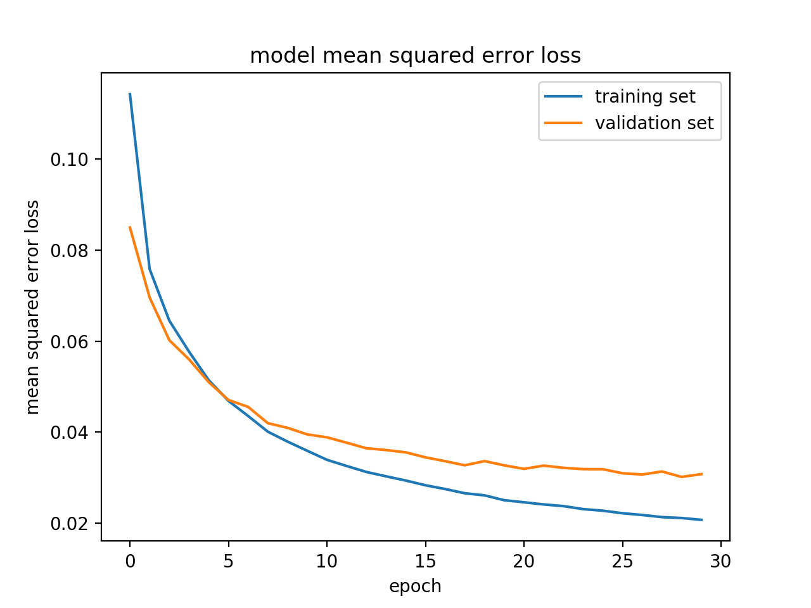
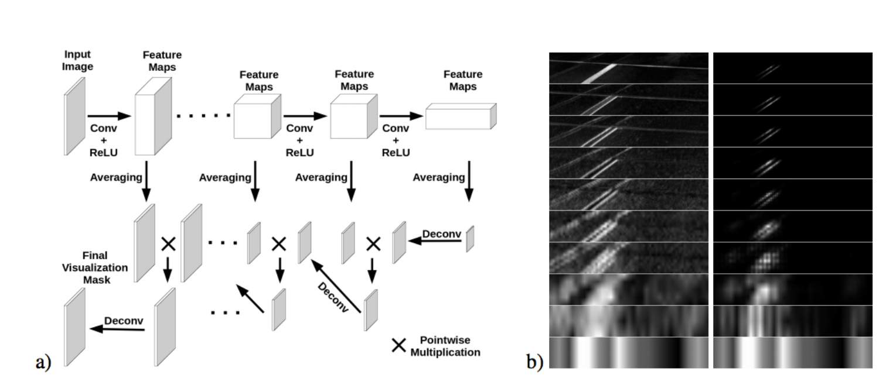

# **Behavioral Cloning** 

---

**Behavioral Cloning Project**

The goals / steps of this project are the following:
* Use the simulator to collect data of good driving behavior
* Build, a convolution neural network in Keras that predicts steering angles from images
* Train and validate the model with a training and validation set
* Test that the model successfully drives around track one without leaving the road
* Summarize the results with a written report


[//]: # (Image References)

[counter_clockwise_1]: ./examples/counter_clockwise_1.jpg "Counter-clockwise"
[counter_clockwise_2]: ./examples/counter_clockwise_2.jpg "Counter-clockwise"

[center]: ./examples/center.jpg "Center"

[left_to_center]: ./examples/left_to_center.jpg "Left to center"
[right_to_center]: ./examples/right_to_center.jpg "Right to center"

[img_center_curve_recovery]: ./examples/center_curve_recovery.jpg "Center Curve recovery"
[img_left_curve_recovery]: ./examples/left_curve_recovery.jpg "Left Curve recovery"
[img_right_curve_recovery]: ./examples/right_curve_recovery.jpg "Right Curve recovery"

[no_shadows]: ./examples/track2_noshadows.jpg "Track 2 no shadows"
[y_no_shadows]: ./examples/y_track2_noshadows.jpeg "Y Track 2 no shadows"
[u_no_shadows]: ./examples/u_track2_noshadows.jpeg "U Track 2 no shadows"
[v_no_shadows]: ./examples/v_track2_noshadows.jpeg "V Track 2 no shadows"

[shadows]: ./examples/track2_shadows.jpg "Y Track 2 shadows"
[y_shadows]: ./examples/y_track2_shadows.jpeg "Y Track 2 shadows"
[u_shadows]: ./examples/u_track2_shadows.jpeg "U Track 2 shadows"
[v_shadows]: ./examples/v_track2_shadows.jpeg "V Track 2 shadows"


[salient_track1_1]: ./examples/result_input_salient_track1_1.jpg "Salient objects"
[salient_track1_2]: ./examples/result_input_salient_track1_2.jpg "Salient objects"
[salient_track1_3]: ./examples/result_input_salient_track1_3.jpg "Salient objects"
[salient_track1_4]: ./examples/result_input_salient_track1_4.jpg "Salient objects"
[salient_track1_5]: ./examples/result_input_salient_track1_5.jpg "Salient objects"

[salient_track2_1]: ./examples/result_input_salient_track2_1.jpg "Salient objects"
[salient_track2_2]: ./examples/result_input_salient_track2_2.jpg "Salient objects"
[salient_track2_3]: ./examples/result_input_salient_track2_3.jpg "Salient objects"
[salient_track2_4]: ./examples/result_input_salient_track2_4.jpg "Salient objects"
[salient_track2_5]: ./examples/result_input_salient_track2_5.jpg "Salient objects"
[salient_track2_6]: ./examples/result_input_salient_track2_6.jpg "Salient objects"

## Rubric Points
Here I will consider the [rubric points](https://review.udacity.com/#!/rubrics/432/view) individually and describe how I addressed each point in my implementation.  

---
You're reading it! and here is a link to my [project code](https://github.com/matheuslrsouza/CarND-Behavioral-Cloning-P3)

### Files Submitted & Code Quality

#### 1. Submission includes all required files and can be used to run the simulator in autonomous mode

My project includes the following files:
* model.py containing the script to create and train the model
* netnvidia.py containing the model construction (CNN) using the NVidia architecture
* drive.py for driving the car in autonomous mode
* model.h5 containing a trained convolution neural network
* salient_objects.py generates views based on the features maps, finding what contributes most to the decision making
* writeup_report.md or writeup_report.pdf summarizing the results

#### 2. Submission includes functional code
Using the Udacity provided simulator and my drive.py file, the car can be driven autonomously around the track by executing 
```sh
python drive.py model.h5
```

#### 3. Submission code is usable and readable

The model.py file contains the code for training and saving the convolution neural network. The file shows the pipeline I used for training and validating the model, and it contains comments to explain how the code works.

### Model Architecture and Training Strategy

#### 1. An appropriate model architecture has been employed

My model consists of a convolution neural network with 5x5 filter sizes and depths between 24 and 48 on first three layers and 3x3 filter sizes and depths 64 on the last two layers (netnvida.py lines 17-22) 

The model includes RELU layers to introduce nonlinearity, and the data is normalized in the model using a Keras lambda layer (code line 14). 

#### 2. Attempts to reduce overfitting in the model

The model contains one agressive dropout layer in order to reduce overfitting (netnvidia.py lines 25). 

The model was trained and validated on different data sets to ensure that the model was not overfitting (model.py code line 99-100). The model was tested by running it through the simulator and ensuring that the vehicle could stay on the track.

#### 3. Model parameter tuning

The model used an adam optimizer, so the learning rate was not tuned manually (netnvidia.py line 38).

#### 4. Appropriate training data

Training data was chosen to keep the vehicle driving on the road. I used a combination of center lane driving, recovering from the left and right sides of the road

For details about how I created the training data, see the next section. 

### Model Architecture and Training Strategy

#### 1. Solution Design Approach

My first step was to use a convolution neural network model similar to the LeNet, I thought this model might be appropriate because it was good to initiate my last project ([Traffic sign](https://github.com/matheuslrsouza/CarND-Traffic-Sign-Classifier-Project/blob/master/Traffic_Sign_Classifier.ipynb))

In order to gauge how well the model was working, I split my image and steering angle data into a training and validation set. I found that my first model had a low mean squared error on the training set but a high mean squared error on the validation set. This implied that the model was overfitting. 

To combat the overfitting, I modified the model to use another architecture like NVidia explains [here](https://devblogs.nvidia.com/parallelforall/deep-learning-self-driving-cars/)

So I re-evaluated the model and could see a much better performance

The final step was to run the simulator to see how well the car was driving around track one. There were a few spots where the vehicle fell off the track (on curves), to improve the driving behavior in these cases, I collected more data focusing on these spots

At the end of the process, the vehicle is able to drive autonomously around the track without leaving the road.

After that I tried to run on the second track, but I did not succeed in it.

My first attempt was to collect data on track 2 in the same way I did with the first one, but, besides not working, this caused the runway track 1 to be broken.
At this point I started adding dropouts to reduce overfitting, even had a low mean squared error in both (training and validation), the car failed to complete any of the routes.

Reading this [NVidia's papper](https://arxiv.org/pdf/1704.07911.pdf) I started trying to use their technique to idendify what matters most in finding salient objects.
After realizing something similar I find out that the shadows had a lot of influence on the predictions.
After that I used another technique described in this papper, split the images into YUV.
I think this abstracted the shadows a bit and I also gained 3 times more data.

After some adjustments in dropout and epochs, the car was able to drive autonomously on both tracks.

I needed to modify the drive.py file to pass only one channel instead of RGB.
I have tested 4 ways to inform the input to the network. Y, U, V and grayscale. What proved to be the best was the Y.

#### 2. Final Model Architecture

The final model architecture (netnvidia.py) consisted of a convolution neural network with the following layers and layer sizes

```
Layer (type)                 Output Shape             
======================================================
Lambda            			 (160, 320, 1)      
______________________________________________________
Cropping2D					 (70, 320, 1)       
______________________________________________________
Conv2D            			 (33, 158, 24)      
______________________________________________________
Conv2D            			 (15, 77, 36)       
______________________________________________________
Conv2D            			 (6, 37, 48)        
______________________________________________________
Conv2D            			 (4, 35, 64)        
______________________________________________________
Conv2D            			 (2, 33, 64)        
______________________________________________________
Flatten						 (4224)             
______________________________________________________
Dropout (0.4)      			 (4224)             
______________________________________________________
Dense              			 (100)              
______________________________________________________
Dense              			 (50)               
______________________________________________________
Dense              			 (10)               
______________________________________________________
Dense              			 (1)                
======================================================
```

#### 3. Creation of the Training Set & Training Process

To capture good driving behavior, I first recorded two laps on track one using center lane driving. Here is an example image of center lane driving:

![alt text][center]

I then recorded the vehicle recovering from the left side and right sides of the road back to center so that the vehicle would learn to back to the center of lane if it goes to the sides. These images show what a recovery looks like starting from left to center then right to center:

![alt text][left_to_center]
![alt text][right_to_center]

After that I recorded another two laps counterclockwise:

![alt text][counter_clockwise_1]
![alt text][counter_clockwise_2]

There is a curve where there is no track (it is after the bridge), the car had difficulties to do it, so I recorded many times recovery in this curve, see some examples

![alt text][img_center_curve_recovery]
![alt text][img_left_curve_recovery]
![alt text][img_right_curve_recovery]

Then I repeated this process on track two in order to get more data points.

To augment the data set, I split the image using the YUV technique. Here is one example:

With no shadows

![alt text][no_shadows]
![alt text][y_no_shadows]
![alt text][u_no_shadows]
![alt text][v_no_shadows]

With shadows

![alt text][shadows]
![alt text][y_shadows]
![alt text][u_shadows]
![alt text][v_shadows]

After the collection process, I had 205,965 (22,885(lines in csv) x 3(center, left and right) x 3(Y, U and V)) number of data points.

I finally randomly shuffled the data set and put 20% of the data into a validation set. 

I used this training data for training the model. The validation set helped determine if the model was over or under fitting. The ideal number of epochs was 30 as evidenced by the below image. I used an adam optimizer so that manually training the learning rate wasn't necessary.




#### 4. Finding salient objects

In order to visualize what the model considers as important to execute the predictions, I tried to use the same technique described in this [papper](https://arxiv.org/pdf/1704.07911.pdf). (code salient_objects.py)

* Use an average pooling on each feature map
* The average for the last feature map is then scaled up for the feature map size of the previous layer, this is done using deconvolution.
* The result of deconvolution is multiplied with the average map of the bellow layer.
* This result is scaled up to the size of the previous feature map as the same way as previously done, and this process is repeated until it reaches the last feature map

This process will generate a mask with the regions that contributed the most to the network output.


Saliente objects architecture. source: https://arxiv.org/pdf/1611.05418.pdf


Here are some samples:

##### Track 1

![alt text][salient_track1_1]
![alt text][salient_track1_2]
![alt text][salient_track1_3]
![alt text][salient_track1_4]
![alt text][salient_track1_5]

##### Track 2

![alt text][salient_track2_1]
![alt text][salient_track2_2]
![alt text][salient_track2_3]
![alt text][salient_track2_4]
![alt text][salient_track2_5]
![alt text][salient_track2_6]

We can see that even where there are no lanes, objects on the edges are considered, such as sand and boxes
To see other areas, look at videos *run_track1_salient.mp4* and *run_track2_salient.mp4*


